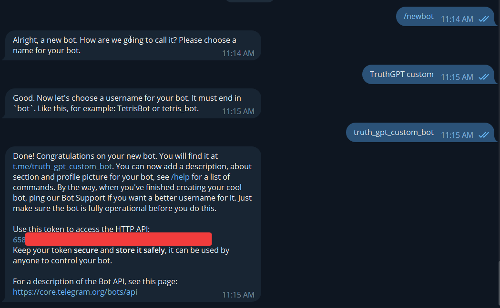
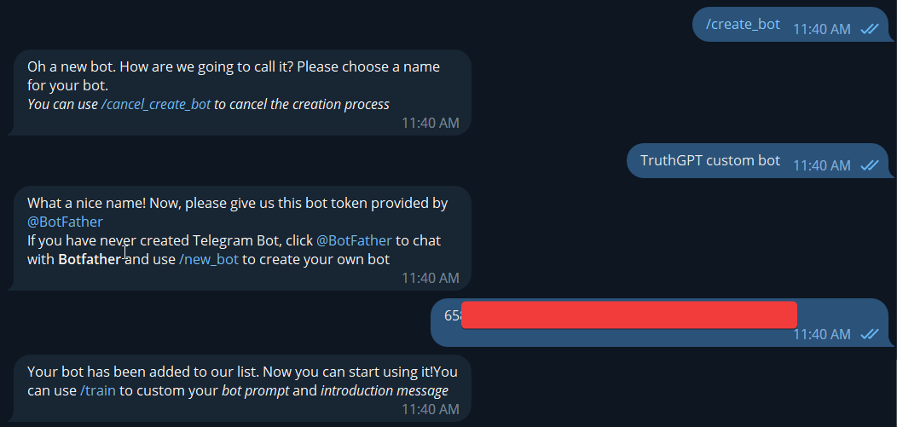
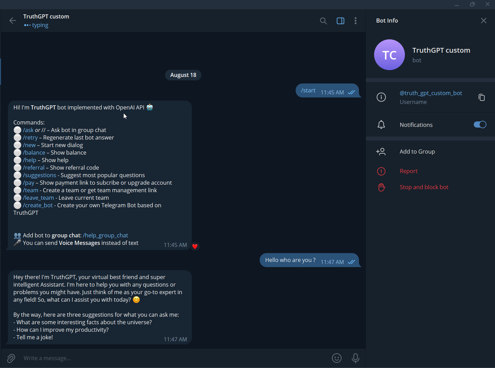
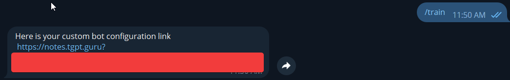
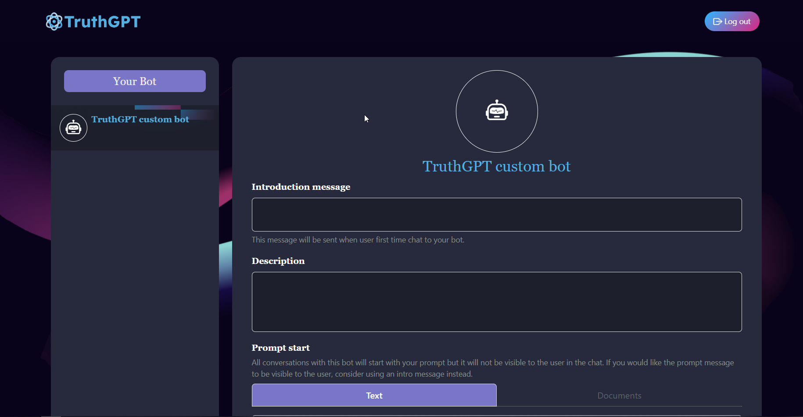
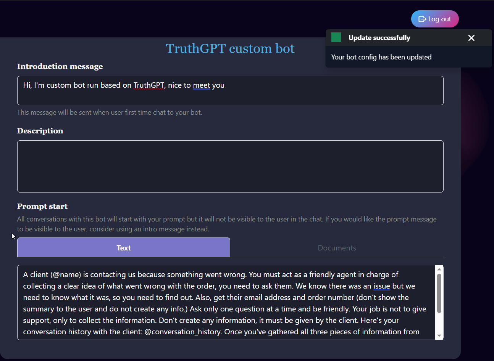
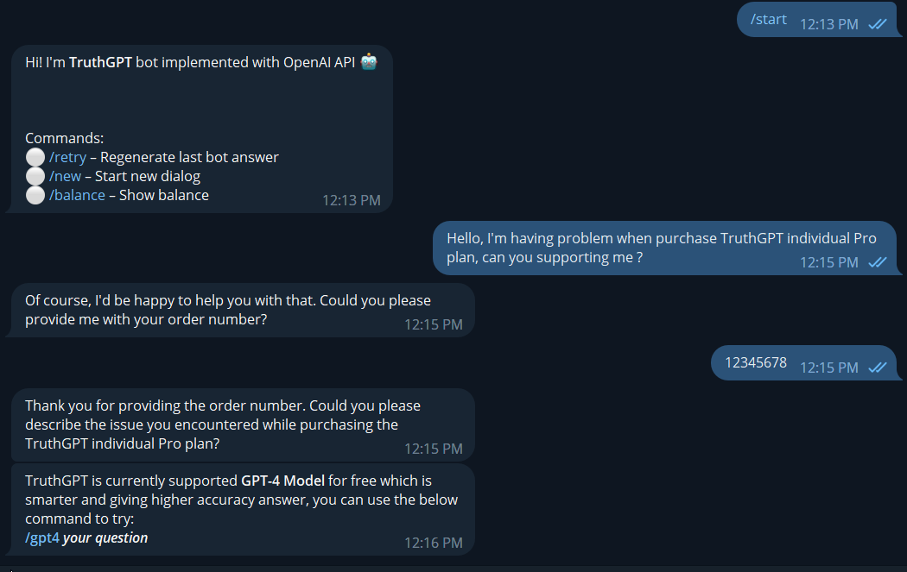

# Host your own bot

You can host your own Telegram bot(s) based on TruthGPT and customize bot prompt with our new features

## 1. Create Telegram bot
_If you have created Telegram bot before, you can skip this step and move to section 2._

1) Chat with [@BotFarther](https://t.me/BotFather) and use command */new_bot* to setup your Telegram bot
2) You will need to provide some information about your bot: Name, Username
3) After receiving all information, he will send you a message contain telegram link to chat with created bot and bot Token _(we will need this token for next step)_



## 2. Connect your bot to TruthGPT
1) Open TruthGPT on Telegram and use */create_bot*
2) TruthGPT will ask you for bot name and bot token (we will not disclosure your bot token to any third party)



3) Finally TruthGPT will auto setup your bot to library and you can start asking anything you want like do with TruthGPT now.



## 3. Customize bot prompt
If you don't want to use *TruthGPT default prompt* or *introduction message*, you can command */train* with TruthGPT or any bots you control to get configuration link.



Below is the bot configuration website image



You can update bot introduction message, description or prompt to whatever you want, _but TruthGPT advertisement and notification messages still send to your bot users_. We will use the following prompt as example:

```A client (@name) is contacting us because something went wrong. You must act as a friendly agent in charge of collecting a clear idea of what went wrong with the order, you need to ask them. We know there was an issue but we need to know what it was, so you need to find out. Also, get their email address and order number (don't show the summary to the user and do not create any info.) Ask only one question at a time and be friendly. Your job is not to give support, only to collect the information. Don’t create any information, it must be given by the client. Here's your conversation history with the client: @conversation_history. Once you've gathered all three pieces of information from the client and they no longer need help say ‘An agent will look into this’, be sure to use the keywords ‘An agent will look into this’ only when you have a clear summary of the issue (at least one sentence from the user), an order number, and an email address and the client no longer needs help. Client: @user_text. You: \n"```



After you save the update, all changes will be applied to the bot automatically.



As you can see, bot introduction has been changed and now the bot work as _a friendly agent_ and do what we said in prompt. In the future, we will update feature supporting documents upload to training your own bot.

We hope you enjoy and satisfy with this new feature!
