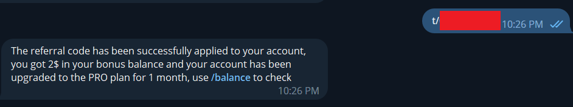
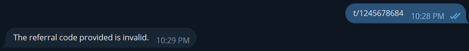

# Referral code

## 1. What is referral code?
Referral codes are unique invitation codes assigned to each user. They serve as a way to invite friends to join Abacus AI and offer enticing rewards. When you refer a friend using your referral code, both you and your friend will receive a $2 bonus and enjoy a 1-month Abacus AI Pro Plan. TeleGPT is a robust chatbot assistant available on Telegram, utilizing artificial intelligence to deliver personalized recommendations and assistance to its users. By sharing your referral link now, you can unlock the perks of the TeleGPT Pro Plan and start benefiting from this powerful AI assistant

To receive your referral code, open TeleGPT in any platforms you used (Telegram, Zalo, Messenger) and send command `/referral`

**Referral code format**: `t/<10 random characters>`

TeleGPT Chatbot in Popular Chat Apps:

 - Telegram: [https://t.me/xtelegpt_bot](https://t.me/xtelegpt_bot)  
 - Messenger: [https://m.me/telegpt.ai.assistant](https://m.me/telegpt.ai.assistant)

## 2. How to use referral code?

If you get a referral code from your friend and want to use it, open Abacus AI in any platforms (Telegram, Zalo, Messenger) then enter referral code, Abacus AI will send you the result of your usage:

* **Used referral code successfully**

* **Invalid code**

* **Your account has already enter referral code before**

