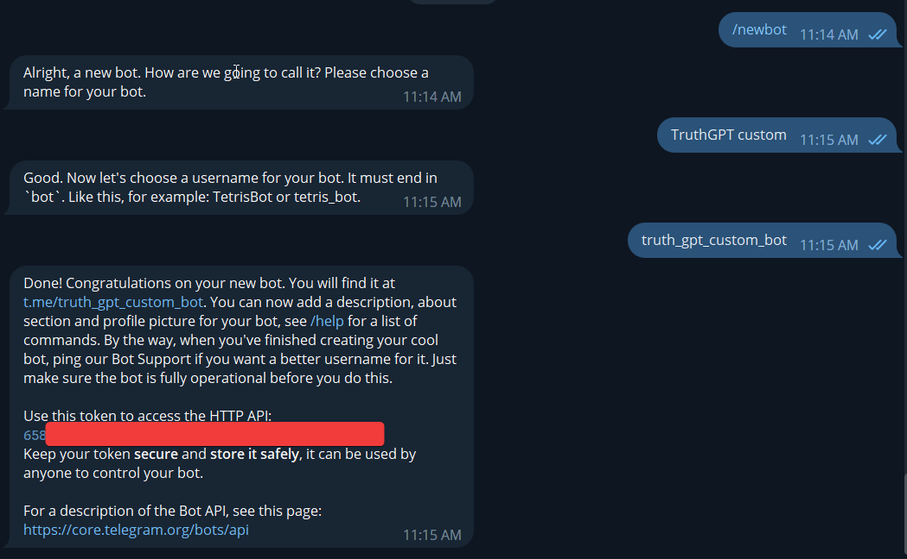
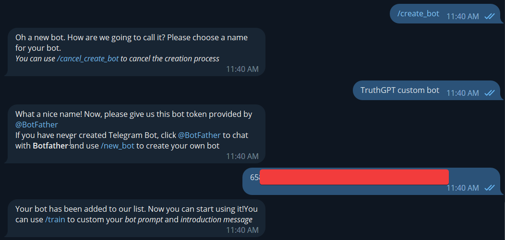
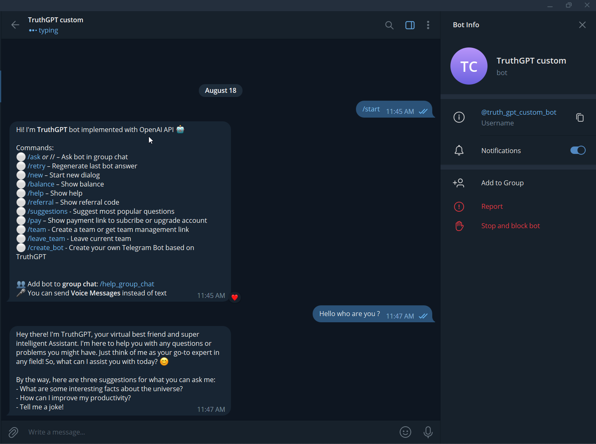
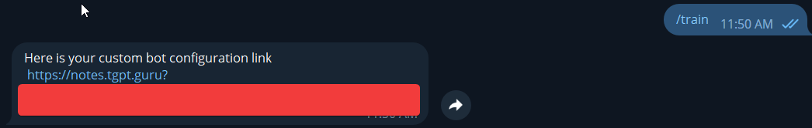
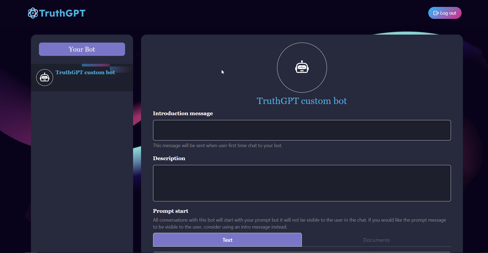
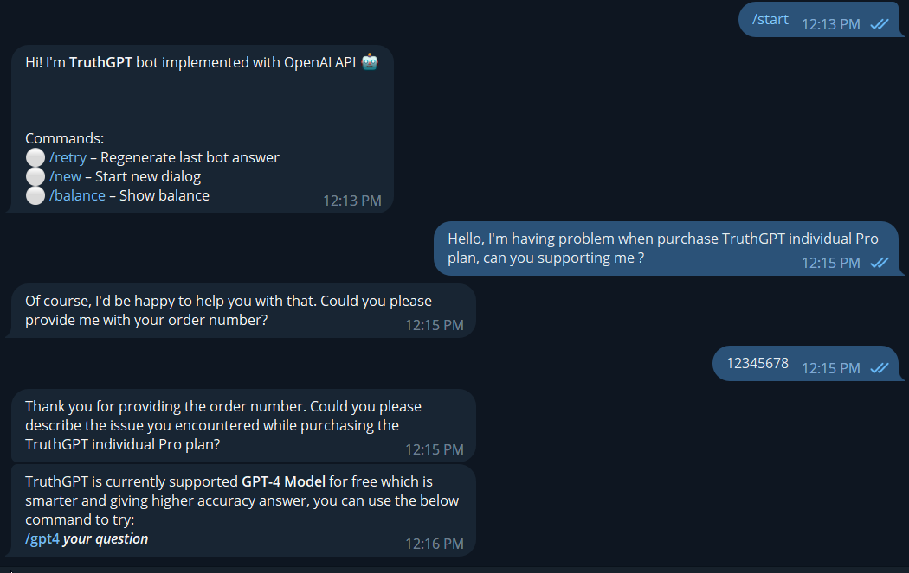

# Tạo bot tùy chỉnh

Bạn có thể vận hành bot Telegram của riêng mình dựa trên TruthGPT và tùy chỉnh prompt của bot với tính năng mới của chúng tôi

## 1. Tạo bot telegram
_Nếu bạn đã từng tạo bot Telegram trước, bạn có thể bỏ qua bước này và chuyển sang phần 2._

1) Trò chuyện với [@botfarther] (https://t.me/botfather) và sử dụng lệnh */new_bot * để thiết lập bot Telegram của bạn
2) Bạn sẽ cần cung cấp một số thông tin về bot: tên gọi, tên người dùng
3) Sau khi nhận được tất cả thông tin, anh ấy sẽ gửi cho bạn một tin nhắn có chứa liên kết chat trực tiếp với bot và bot token _(chúng tôi sẽ cần token này cho bước tiếp theo)_



## 2. Kết nối bot của bạn với TruthGPT
1) Mở TruthGPT trên Telegram và sử dụng lệnh */created_bot *
2) TruthGPT sẽ yêu cầu bạn về tên bot và bot token (chúng tôi sẽ không tiết lộ mã bot token của bạn cho bất kỳ bên thứ ba khác)



3) Cuối cùng, TruthGPT sẽ tự động thiết lập bot của bạn vào thư viện và bạn có thể bắt đầu hỏi bất cứ điều gì bạn muốn bây giờ như tương tác với TruthGPT.



## 3. Tùy chỉnh bot
Nếu bạn không muốn sử dụng *prompt mặc định của TruthGPT* hoặc *tin nhắn bắt đầu*, bạn có thể dùng lệnh */train* với TruthGPT hoặc bất kỳ bot nào bạn kiểm soát để nhận liên kết cấu hình bot.



Dưới đây là giao diện trang web cấu hình bot



Bạn có thể cập nhật tin nhắn bắt đầu, mô tả hoặc prompt theo ý bạn, _nhưng các tin nhắn quảng cáo và thông báo của TruthGPT vẫn sẽ được gửi cho người dùng bot của bạn_.Chúng tôi sẽ sử dụng prompt sau làm ví dụ:

```A client (@name) is contacting us because something went wrong. You must act as a friendly agent in charge of collecting a clear idea of what went wrong with the order, you need to ask them. We know there was an issue but we need to know what it was, so you need to find out. Also, get their email address and order number (don't show the summary to the user and do not create any info.) Ask only one question at a time and be friendly. Your job is not to give support, only to collect the information. Don’t create any information, it must be given by the client. Here's your conversation history with the client: @conversation_history. Once you've gathered all three pieces of information from the client and they no longer need help say ‘An agent will look into this’, be sure to use the keywords ‘An agent will look into this’ only when you have a clear summary of the issue (at least one sentence from the user), an order number, and an email address and the client no longer needs help. Client: @user_text. You: \n"```


Sau khi bạn lưu bản cập nhật, tất cả các thay đổi sẽ được áp dụng tự động cho bot.



Như bạn có thể thấy, giới thiệu bot đã được thay đổi và bây giờ bot hoạt động như _nhân viên chăm sóc khách hàng tự động_ và làm những gì chúng tôi đã nói trong nhắc nhở. Trong tương lai, chúng tôi sẽ cập nhật tính năng hỗ trợ tải và phân tích tài liệu để hỗ trợ tốt hơn đào tạo bot của riêng bạn.

Chúng tôi hy vọng bạn thích và hài lòng với tính năng mới này!