# Các lệnh trong TeleGPT

## 1. /help
Hiển thị tất cả các lệnh của TeleGPT và chức năng của chúng

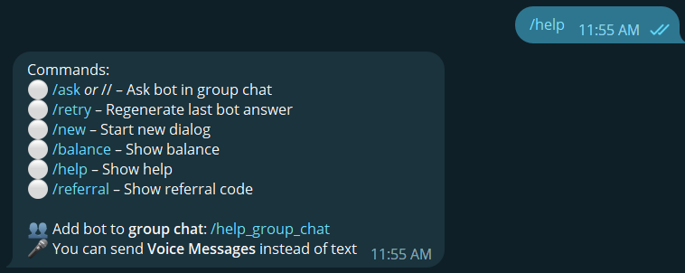

## 2. /ask hoặc //
Lệnh này dùng trong trường hợp bạn muốn hỏi TeleGPT trong Group chat, Nếu bạn chat trực tiếp với bot thì không cần dùng lệnh này

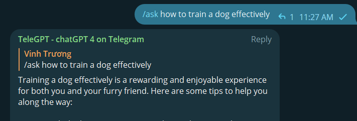

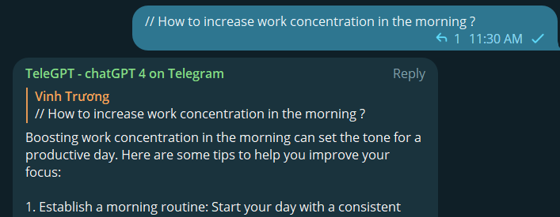

Hơn nữa, bạn có thể tag TeleGPT trong nhóm chat để gọi bot thay vì sử dụng lệnh **/ask**

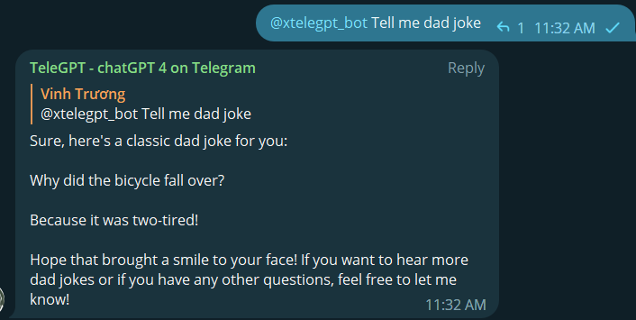

## 3. /retry
Nếu bạn không hài lòng với câu trả lời nhận được, bạn có thể sử dụng lệnh này để yêu cầu TeleGPT đưa ra câu trả lời khác cho bạn.

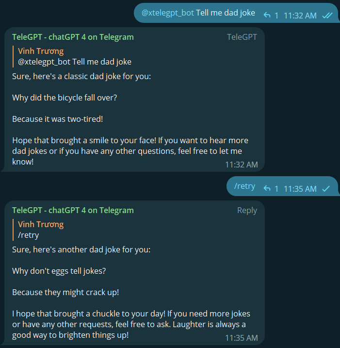

## 4. /new
Tất cả các tương tác của bạn với TeleGPT sẽ được lưu dưới dạng một cuộc đối thoại (dialouge), được thực hiện để TeleGPT lưu tất cả các câu hỏi trước đó, ngôn ngữ bạn sử dụng và ngữ cảnh của cuộc trò chuyện. Điều này giúp nâng cao trải nghiệm người dùng và cải thiện độ chính xác của câu trả lời cho các câu hỏi tiếp theo.

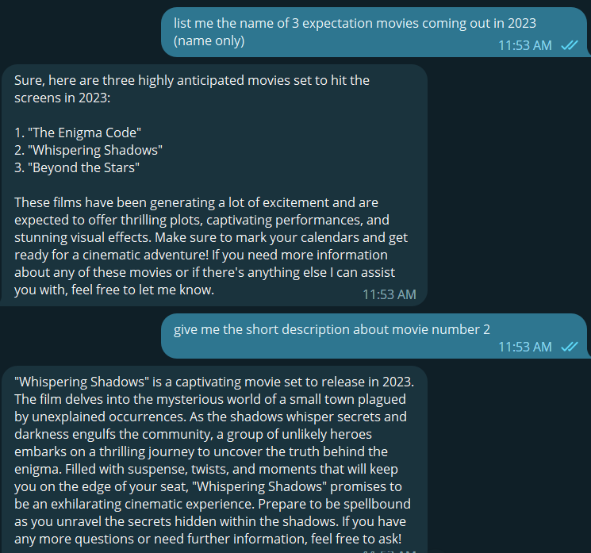

Nếu bạn muốn thay đổi chủ đề hoặc nếu TeleGPT trả lời sai ngôn ngữ, bạn có thể sử dụng lệnh **/new** để bắt đầu một cuộc đối thoại mới và tiếp tục đặt câu hỏi.

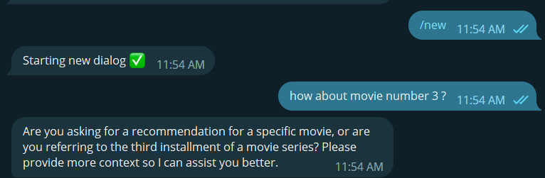

## 5. /balance
Lệnh này sẽ hiển thị cho bạn số dư còn lại trong tài khoản của bạn, mỗi truy vấn trong TeleGPT sẽ tính phí tài khoản của bạn nếu bạn đang sử dụng tài khoản **REGULAR**. Để tìm hiểu về **số dư tài khoản** và **loại tài khoản** hãy truy cập vào liên kết sau.

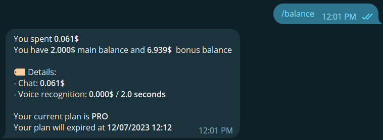

## 6. /referral
Lệnh này được sử dụng để hiển thị mã giới thiệu của tài khoản của bạn. Tất cả thông tin về mã giới thiệu và cách sử dụng được mô tả [tại đây](/vi/user-guide/referral-code)

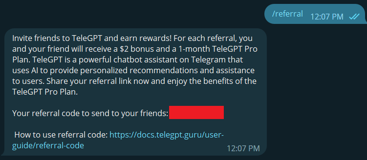

## 7. /pay
Bạn có thể sử dụng lệnh này để nhận liên kết thanh toán tài khoản của mình, bạn có thể truy cập trang web này để nâng cấp gói TeleGPT của mình (**PRO** hoặc **PRO Team**)

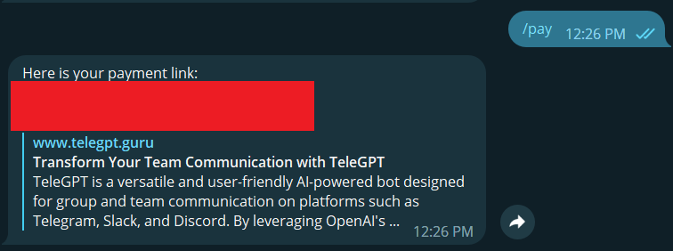

## 8. /team
Sử dụng lệnh này để tạo nhóm của riêng bạn, mỗi nhóm có thể có từ 1 đến 100 thành viên tùy thuộc vào số lượng gói nâng cấp nhóm (Team plan) mà bạn mua. Bạn chỉ có thể sử dụng lệnh này trong **cuộc trò chuyện trực tiếp**

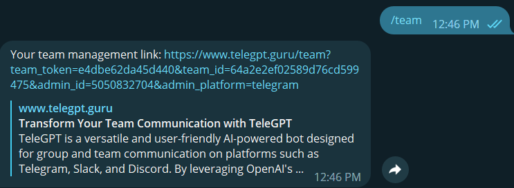

Mỗi khi sử dụng **/team**, bạn sẽ nhận được **liên kết sử dụng 1 lần** dùng để truy cập trang web quản lý nhóm của mình. Điều này có nghĩa là khi bạn đăng xuất hoặc truy cập từ thiết bị khác, bạn phải gọi lại lệnh này để nhận một liên kết mới, bạn có thể sử dụng một liên kết cũ nếu bạn truy cập từ cùng một trình duyệt trên thiết bị trước đó

## 9. /team_code
Bạn có thể sử dụng **/team_code** khi bạn chỉ là quản trị viên/chủ sở hữu nhóm. Lệnh này sẽ gửi cho bạn mã tham gia nhóm của bạn để mời người dùng khác vào nhóm của bạn (mã này có thể được gia hạn trong trang quản lý nhóm). Truy cập [tại đây](/vi/user-guilde/team-code) để biết thêm thông tin về **mã tham gia nhóm**

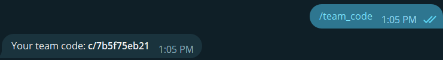

## 10. /leave_team
Nếu bạn muốn rời nhóm hiện tại hoặc chuyển sang nhóm khác, hãy gọi **/leave_team** để rời khỏi nhóm.

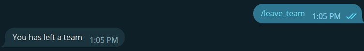
